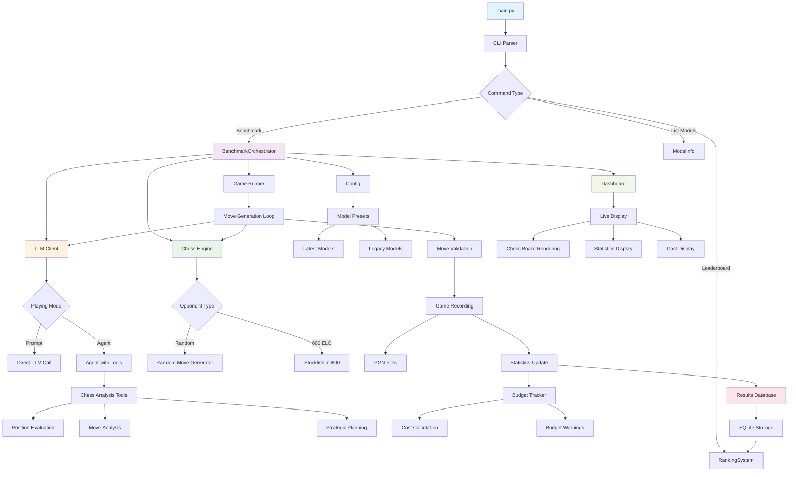

# 🏆 Chess LLM Benchmark

**A streamlined tool for evaluating Large Language Models through chess gameplay with simple, focused testing options.**

[](https://www.python.org/downloads/)
[](LICENSE)
[](https://openai.com/)
[](https://anthropic.com/)
[](https://ai.google.dev/)

## ✨ Features

- 🤖 **Multi-Provider Support**: Latest models from OpenAI, Anthropic, and Google
- 🎯 **Simple Opponent Selection**: Choose between random moves or 600 ELO engine
- 🧠 **Dual Playing Modes**: Prompt-based (default) or agent-based reasoning with tools
- 🎨 **Beautiful Terminal UI**: Real-time chess board visualization with rich formatting
- 📁 **Performance Analytics**: Win rates, timing analysis, and game statistics
- 💰 **Budget Tracking**: Real-time cost monitoring with spending limits
- 🏆 **Historical Leaderboards**: Compare model performance over time
- 💾 **Game Recording**: All games saved in PGN format
- 📦 **Model Presets**: Latest (default) or legacy model collections

## 🎰 Run Demo


## 🚀 Quick Start

### Installation

```bash
# Clone the repository
git clone https://github.com/yourusername/chess-llm-benchmark.git
cd chess-llm-benchmark

# Install dependencies
pip install -r requirements.txt

# Install Stockfish (required chess engine)
# macOS:
brew install stockfish

# Ubuntu/Debian:
sudo apt-get install stockfish

# Windows:
choco install stockfish
```

### Set Up API Keys

Create a `.env` file in the project root:

```env
OPENAI_API_KEY="your-openai-api-key"
ANTHROPIC_API_KEY="your-anthropic-api-key"
GEMINI_API_KEY="your-gemini-api-key"
```

### Run Your First Benchmark

```bash
# Default: Latest models vs random opponent, prompt-based
python main.py

# Use legacy models with cost tracking
python main.py --preset legacy --budget-limit 5.0 --show-costs

# Agent-based reasoning against 600 ELO opponent
python main.py --use-agent --opponent lowest-elo

# Custom model selection
python main.py --bots "openai:gpt-4o:GPT-4o,anthropic:claude-3-5-sonnet:Claude-Sonnet"

# View performance leaderboard
python main.py --leaderboard 10
```

## 📏 Project Structure

```
chess-llm-benchmark/
├── main.py                    # Entry point
├── requirements.txt           # Dependencies
├── setup.py                   # Package configuration
├── .env.example               # API key template
├── README.md                  # This file
│
├── chess_llm_bench/           # Main package
│   ├── __init__.py
│   ├── cli.py                 # Command-line interface
│   │
│   ├── core/                  # Core game logic
│   │   ├── models.py          # Data models and configuration
│   │   ├── engine.py          # Chess engine management
│   │   ├── game.py            # Game execution and ladder logic
│   │   ├── budget.py          # Cost tracking and budget management
│   │   └── results.py         # Database storage and ranking system
│   │
│   ├── llm/                   # LLM integration
│   │   ├── client.py          # Unified LLM client interface
│   │   ├── models.py          # Model definitions and presets
│   │   └── agents/            # Agent-based reasoning
│   │       ├── __init__.py
│   │       ├── base_agent.py     # Agent base classes
│   │       ├── chess_tools.py    # Chess analysis tools
│   │       └── llm_agent_provider.py  # LLM agent implementation
│   │
│   └── ui/                    # User interface
│       ├── dashboard.py       # Live terminal dashboard
│       └── board.py           # Chess board visualization
│
├── examples/                  # Example scripts and demos
│   ├── agent_demo.py          # Agent vs prompt comparison
│   └── budget_and_ranking_demo.py  # Cost and ranking examples
│
├── tests/                     # Test suite
│   ├── test_agents.py
│   ├── test_bots.py
│   └── test_engine.py
│
└── runs/                      # Benchmark results and PGN files
    └── YYYYMMDD_HHMMSS/       # Timestamped run directories
        ├── config.json        # Run configuration
        ├── summary.json       # Results summary
        └── games/             # Individual game PGN files
```

## 📊 System Architecture



### Key Components:

1. **CLI Layer**: Handles command parsing and user interaction
2. **Orchestration Layer**: Coordinates all components for benchmark execution
3. **LLM Layer**: Manages different LLM providers and playing modes
4. **Engine Layer**: Handles chess opponents (random or ELO-based)
5. **Game Layer**: Executes chess games and validates moves
6. **Storage Layer**: Persists results and manages historical data
7. **UI Layer**: Provides real-time visualization and feedback
8. **Budget Layer**: Tracks costs and enforces spending limits

## 🤖 Available Models

### Latest Models (Default Preset)
- **OpenAI**: GPT-4o, GPT-4o Mini
- **Anthropic**: Claude 3.5 Sonnet, Claude 3.5 Haiku
- **Google**: Gemini 2.5 Pro, Gemini 2.5 Flash

### Legacy Models Preset
- **OpenAI**: GPT-4 Turbo, GPT-3.5 Turbo
- **Anthropic**: Claude 3 Opus, Claude 3 Haiku
- **Google**: Gemini 1.0 Pro

## 🎯 Configuration Options

### Model Presets
| Preset | Description | Models |
|--------|-------------|--------|
| `latest` (default) | Latest models from each provider | GPT-4o, GPT-4o Mini, Claude 3.5 Sonnet, Claude 3.5 Haiku, Gemini 2.5 Pro, Gemini 2.5 Flash |
| `legacy` | Legacy models from each provider | GPT-4 Turbo, GPT-3.5 Turbo, Claude 3 Opus, Claude 3 Haiku, Gemini 1.0 Pro |

### Opponent Options
| Option | Description |
|--------|--------------|
| `random` (default) | Plays random legal moves |
| `lowest-elo` | Plays at 600 ELO strength using Stockfish |

### Playing Modes
| Mode | Description |
|------|-------------|
| Prompt-based (default) | Direct LLM prompting for move generation |
| Agent-based (`--use-agent`) | Tool-based reasoning with chess analysis |

## 📋 Usage Examples

### Basic Usage

```bash
# Default run with latest models
python main.py

# Use legacy models
python main.py --preset legacy

# Custom model selection
python main.py --bots "openai:gpt-4o:GPT-4o,anthropic:claude-3-5-sonnet:Claude-Sonnet"

# List available models
python main.py --list-models

# List available presets
python main.py --list-presets
```

### Opponent Selection

```bash
# Play against random moves (default)
python main.py --opponent random

# Play against 600 ELO Stockfish engine
python main.py --opponent lowest-elo
```

### Playing Modes

```bash
# Prompt-based reasoning (default)
python main.py

# Agent-based reasoning with chess analysis tools
python main.py --use-agent

# Compare both modes
python examples/agent_demo.py
```

### Budget and Cost Tracking

```bash
# Set spending limit and show costs
python main.py --budget-limit 10.0 --show-costs

# Track costs without limit
python main.py --show-costs

# Budget tracking example
python examples/budget_and_ranking_demo.py
```

### Analysis and Leaderboards

```bash
# View top 10 models
python main.py --leaderboard 10

# Show all available models
python main.py --leaderboard

# Run comprehensive analysis
python examples/comprehensive_test.py
```


## 🎮 Live Dashboard

The benchmark features a beautiful real-time terminal dashboard that shows:

- **🎨 Chess Board Visualization**: Live ASCII chess board with move highlighting
- **📁 Performance Metrics**: Win rates, game statistics, and timing analysis
- **💰 Cost Tracking**: Real-time budget usage and spending alerts
- **🏆 Progress Updates**: Live status of each model's performance
- **⏱️ Move Timing**: Response speed analysis for each model

Example enhanced summary table:
```
┃ Bot               ┃ Status      ┃ Max ELO ┃ Games ┃ Win Rate ┃ Record    ┃ Avg Time ┃ Illegal Moves ┃
┃ Claude 3.5 Sonnet ┃ ✅ Finished ┃    1400 ┃     8 ┃    62.5% ┃ 5W-0D-3L  ┃    2.34s ┃           12  ┃
┃ GPT-4o            ┃ 🤔 Thinking ┃    1200 ┃     6 ┃    50.0% ┃ 3W-0D-3L  ┃    1.87s ┃            8  ┃
```

### 🎯 Benefits of Enhanced Metrics

**Move Timing Analysis** helps you:
- **Cost Optimization**: Estimate API costs based on response times
- **Performance Comparison**: Compare model speed vs accuracy trade-offs
- **Efficiency Ranking**: Identify fastest models for time-critical applications

**Illegal Move Detection** reveals:
- **Rule Understanding**: How well models comprehend chess rules
- **Model Quality**: Lower illegal moves indicate better training
- **Reliability Assessment**: Models with fewer errors are more dependable

```
╭─────── 🏆 Chess LLM ELO Ladder Benchmark ────────╮
│  ╭──────────────── 📊 Summary ────────────────╮  │
│  │ ┏━━━━━━━━━━━━━━━━━━┳━━━━━━━━━┳━━━━━━━━━━━┓ │  │
│  │ ┃ Bot              ┃ Max ELO ┃ Win Rate  ┃ │  │
│  │ ┡━━━━━━━━━━━━━━━━━━╇━━━━━━━━━╇━━━━━━━━━━━┩ │  │
│  │ │ GPT-4o           │    1400 │    67.5%  │ │  │
│  │ │ Claude 3.5       │    1200 │    55.2%  │ │  │
│  │ │ Gemini 1.5 Pro   │    1100 │    48.3%  │ │  │
│  │ └──────────────────┴─────────┴───────────┘ │  │
│  ╰────────────────────────────────────────────╯  │
│  ╭──────────────── GPT-4o ────────────────────╮  │
│  │ Ladder: 600 → 800 → 1000 → 1200 → 1400     │  │
│  │ ╭─ Move 24 | Last: Nf6+ ──╮Status: vs 1400│  │
│  │ │  a b c d e f g h       │Current ELO:    │  │
│  │ │8 ♜   ♝ ♛ ♚ ♝   ♜ 8     │1400           │  │
│  │ │7 ♟ ♟   ♟   ♟ ♟ ♟ 7     │Color: White   │  │
│  │ │6       ♞           6     │Moves: 47      │  │
│  │ │5         ♙         5     │               │  │
│  │ │4   ♙     ♙         4     │Win Rate: 67.5%│  │
│  │ │3     ♘   ♗         3     │Games: 8       │  │
│  │ │2 ♙     ♙   ♙ ♙ ♙   2     │Record: 5W-1D- │  │
│  │ │1 ♖ ♘ ♗ ♕ ♔     ♖   1     │2L            │  │
│  │ ╰─────────────────────────╯               │  │
│  ╰────────────────────────────────────────────╯  │
╰──────────────────────────────────────────────────╯
```

## 📊 Results and Analysis

### Output Structure

```
runs/
└── YYYYMMDD_HHMMSS/
    ├── summary.json          # Benchmark results summary
    ├── config.json           # Configuration used
    ├── games/                # Individual game PGN files
    │   ├── gpt4o_vs_stockfish_600.pgn
    │   └── claude_vs_stockfish_800.pgn
    └── analysis/             # Performance analysis
        └── statistics.json
```

### Performance Metrics

Each bot is evaluated on:
- **Maximum ELO Reached**: Highest Stockfish rating defeated
- **Win Rate**: Percentage of games won
- **Average Game Length**: Moves per game
- **Game Duration Tracking**: Total time per game including API response times
- **Move Timing Analysis**: Average time per move and response speed metrics
- **Move Quality Assessment**: Illegal move attempts and rule comprehension scoring
- **Opening Performance**: Success with different openings
- **Endgame Strength**: Performance in late-game positions
- **Cost Efficiency**: Performance per dollar spent
- **Consistency Score**: Standard deviation of ELO performance

## ⚙️ Command Line Options

### Essential Arguments

```bash
# Model Selection
--preset {latest,legacy}             # Model preset (default: latest)
--bots "provider:model:name,..."     # Custom bot specification

# Opponent Selection
--opponent {random,lowest-elo}       # Opponent type (default: random)

# Playing Mode
--use-agent                          # Use agent-based reasoning (default: prompt-based)

# Budget Tracking
--budget-limit AMOUNT                # Set spending limit in USD
--show-costs                         # Display cost tracking

# Analysis
--leaderboard [N]                    # Show top N models (default: 20)

# Game Settings
--max-games N                        # Maximum games per model (default: 10)

# Information
--list-models                        # List available models
--list-presets                       # List available presets
--help                               # Show help message
```

### Bot Specification Format

```
provider:model:name

Examples:
openai:gpt-4o:GPT-4o
anthropic:claude-3-5-sonnet-20241022:Claude-3.5-Sonnet
gemini:gemini-1.5-pro:Gemini-1.5-Pro
random::Baseline
```

## 🔬 How It Works

### Playing Modes

**Prompt-based (Default)**:
- Sends the chess position and legal moves directly to the LLM
- Asks for a move in UCI notation (e.g., "e2e4")
- Simple and fast, good for basic chess performance testing

**Agent-based (`--use-agent`)**:
- Uses structured reasoning with chess analysis tools
- Evaluates position, considers multiple candidate moves
- Makes decisions based on chess principles and analysis
- Slower but more sophisticated chess understanding

### Opponent Types

- **Random**: Plays completely random legal moves (good for basic testing)
- **600 ELO Engine**: Uses Stockfish at beginner strength (more realistic opponent)

## 🔧 Development

### Running Tests

```bash
# Run with pytest
pytest tests/ -v

# Type checking (if mypy installed)
mypy chess_llm_bench/

# Code formatting (if black installed)
black chess_llm_bench/
```

## 💰 Budget Tracking

### Cost Management
```bash
# Set $10 budget limit with cost display
python main.py --budget-limit 10.0 --show-costs

# Track costs without limit
python main.py --show-costs
```

### Features
- **Real-time tracking**: See costs accumulate during benchmarking
- **Budget limits**: Set spending caps with automatic warnings at 50%, 75%, 90%, and 100%
- **Cost breakdown**: Analysis by provider, model, and individual bot
- **Historical tracking**: Cost trends stored in database

### Approximate Costs (per 1K tokens)
- **GPT-4o**: $0.0025 input, $0.01 output (~$0.065/game)
- **GPT-4o Mini**: $0.00015 input, $0.0006 output (~$0.004/game)
- **Claude 3.5 Sonnet**: $0.003 input, $0.015 output (~$0.048/game)
- **Claude 3.5 Haiku**: $0.0008 input, $0.004 output (~$0.019/game)
- **Gemini 2.5 Pro**: $0.00125 input, $0.005 output (~$0.027/game)
- **Gemini 2.5 Flash**: $0.000075 input, $0.0003 output (~$0.002/game)

## 🏆 Performance Tracking

### Leaderboard
```bash
# Show top 10 performing models
python main.py --leaderboard 10

# Show top 20 (default)
python main.py --leaderboard
```

### Database Storage
All results automatically stored in SQLite database (`data/results.db`) for:
- Historical performance comparison
- Cost analysis and trend tracking
- Model improvement identification
- Performance comparisons across runs
- Cost tracking and efficiency analysis
- Statistical significance testing

## 🤝 Contributing

Contributions welcome! Please fork the repository, create a feature branch, make your changes, and open a Pull Request.

## 📝 License

MIT License - see [LICENSE](LICENSE) file for details.

## 📢 Support

- 🐛 **Issues**: [GitHub Issues](https://github.com/Youssef2430/chessLLM/issues)
- 📧 **Email**: youssefchouay30@gmail.com

---

**Made with ♟️ and 🤖 by Youssef**
