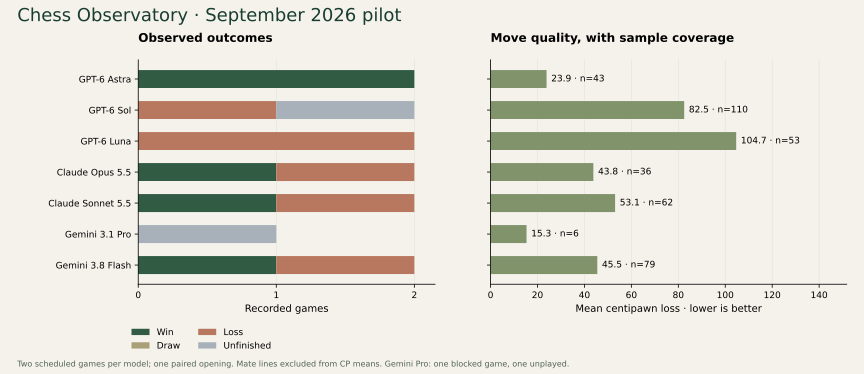
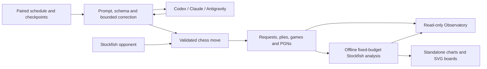

# Chess LLM Benchmark

Compare language models through chess games against Stockfish, with replayable
positions, explicit failure handling, and recorded reasoning/token usage where
clients expose it. The local **Chess Observatory** combines model comparisons,
game replay, evaluation charts, and request diagnostics.

The current workflow uses signed-in **Codex, Claude Code and Antigravity ACP**
subscriptions. API-key fallback is disabled. A separate API-billed runner remains
available. Neither workflow measures an LLM's FIDE or online Elo rating.

## Latest pilot · September 30, 2026

High reasoning effort, one opening played with both colors, Stockfish 17.1 at
native `UCI_Elo=1320`, and a 200-ply limit. Two scheduled games per model.

| Model | Wins | Draws | Losses | Unfinished / unavailable |
|---|---:|---:|---:|---|
| GPT-6 Astra | 2 | 0 | 0 | — |
| GPT-6 Sol | 0 | 0 | 1 | 1 reached the 200-ply limit |
| GPT-6 Luna | 0 | 0 | 2 | — |
| Claude Opus 5.5 | 1 | 0 | 1 | — |
| Claude Sonnet 5.5 | 1 | 0 | 1 | — |
| Gemini 3.8 Flash | 1 | 0 | 1 | — |
| Gemini 3.1 Pro | 0 | 0 | 0 | Tool use blocked game 1; game 2 not started |

**475 requests · 466 accepted moves analyzed · 11 completed games · zero
invalid-response forfeits.** Three invalid answers were corrected, and three
operator interruptions were recorded separately from provider failures.



Astra had the strongest observed outcome in this small sample. Two games from one
opening pair do not establish a ranking or predict a ten-game result. Truncated
and blocked games are not draws. Client harnesses differ, and GPT concurrency
changed during the run; use the recorded settings when interpreting latency.

[Results, limitations and game files](benchmarks/2026-09-30-pilot/README.md) ·
[Architecture](docs/architecture.md) · [Protocol 3 guide](docs/protocol-v3.md)

## Install

Python 3.10+ on macOS or Linux. Subscription runs require Stockfish on `PATH`:
`brew install stockfish` on macOS, or `sudo apt install stockfish` on Ubuntu.

```sh
python3 -m venv .venv
source .venv/bin/activate
python -m pip install -e '.[charts,dev]'
```

Sign in to the clients you plan to use (`codex login`, `claude auth login`).
Antigravity uses an existing T3-managed ACP installation and personal OAuth
profile when available. Availability is checked before play; unavailable models
are recorded without substitutions. No Haiku or historical models are in the
subscription runner's default roster.

## Explore the published results without model calls

```sh
python -m chess_llm_bench.observatory --runs-dir benchmarks --port 8770
```

Open **http://127.0.0.1:8770**. The committed snapshot includes all played positions,
PGNs, analysis and allowlisted request metrics. Raw prompts, model responses,
client traces and account-specific details remain local and are omitted from
this public snapshot. The corresponding inspector fields are unavailable there.

## Run a two-game subscription pilot

```sh
python -m chess_llm_bench.runner --output-dir runs/my-pilot --detach
python -m chess_llm_bench.observatory --port 8770

# In another terminal: offline analysis and chart generation; no model requests.
python -m chess_llm_bench.watch_run runs/my-pilot \
  --output-dir runs/my-pilot/figures --interval 60
```

Defaults: two games/model, high effort, 180 seconds/request, at most three
application attempts per decision, and **three concurrent GPT requests**, one per
model. Claude and Antigravity each share one request slot. `--models` narrows the
roster. `--timeout`, `--effort`, and `--codex-concurrency` configure new experiments.
The published pilot used a 360-second timeout.

Structured output is requested where supported. The parser accepts explicit legal
final moves without selecting arbitrary tokens from analysis. Invalid responses
receive bounded correction attempts. Exhausted invalid responses forfeit; service
failures and interruptions do not become chess losses. Every attempt is retained.

```sh
# Resume with recorded settings and saved positions.
python -m chess_llm_bench.runner --output-dir runs/my-pilot --resume --detach

# Offline integration smoke test: random moves, local Stockfish, no account usage.
python -m chess_llm_bench.runner --output-dir /tmp/chess-smoke-NEW \
  --offline --games 2 --max-plies 8
```

Detached runs print a PID and log location. SIGTERM/SIGINT checkpoint active games.
Resume preserves attempt budgets and reuses saved accepted responses. Restart the
analysis watcher after resuming. Tool-use/model-mismatch blocks remain blocked.
Local Mac completion notifications are available through
`python -m chess_llm_bench.notify_run runs/my-pilot` while its watcher is running.

Subscription calls consume account allowance. Tokens and API-equivalent figures
are not subscription charges; the clients do not expose a reliable incremental
bill. The runner does not buy credits or fall back to API keys.

## Architecture and data


```mermaid
flowchart LR
    Runner[Paired schedule and checkpoints] --> Decision[Prompt, schema and bounded correction]
    Decision --> Clients[Codex / Claude / Antigravity]
    Clients --> Decision
    Decision --> Game[Validated chess move]
    Engine[Stockfish opponent] --> Game
    Game --> Journal[Requests, plies, games and PGNs]
    Journal --> Analysis[Offline fixed-budget Stockfish analysis]
    Journal --> UI[Read-only Observatory]
    Analysis --> UI
    Analysis --> Figures[Standalone charts and SVG boards]
```

The opponent and offline analyzer are separate. Models never receive engine
recommendations. Durable JSONL journals, atomic position checkpoints and an
exclusive writer lease support recovery. A live heartbeat distinguishes active
runs from abandoned manifests. [Architecture details](docs/architecture.md)
explain module boundaries, storage and remaining reproducibility limits.

## Optional API workflow and historical baselines

The [API protocol 2 guide](docs/api-protocol-v2.md) covers API keys, request budgets,
pricing scenarios and the terminal UI. It can incur API charges. Its presets and
strict-output policy differ from the subscription pilot.

The [strict subscription baseline](docs/subscription-benchmark.md) and
[original refresh review](docs/refresh-review.md) are historical context, not
additional samples in the published pilot. Raw runs and the historical SQLite
database are local artifacts; they are not included in this repository's new snapshot.

## Development

```sh
python -m pytest tests -q -W error::RuntimeWarning
```

Tests use simulated provider responses and local engines, with no model requests.
CI runs Python 3.10 and 3.13, including a Stockfish smoke test and package checks.
Experimental human/adaptive engines and direct agents remain outside the standard
subscription protocol. Model IDs, client behavior and subscription availability
can change; every experiment records its requested settings and exposed versions.

MIT license.
