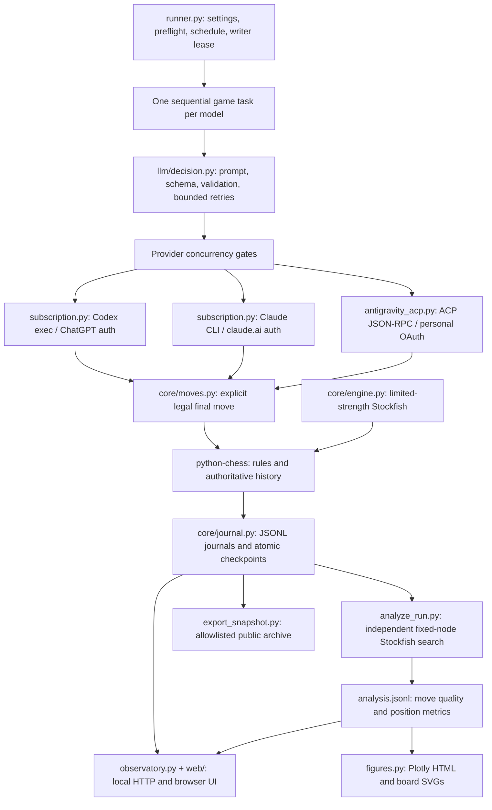

# Architecture

Protocol 3 is a local, subscription-backed chess runner with a separate analysis
pipeline and read-only results interface. The current defaults are a two-game
pilot and three concurrent GPT requests. The API runner remains a separate
protocol and billing route.

## Components

| Module | Responsibility |
|---|---|
| `runner.py` | Immutable run settings on ordinary resume, paired openings, client availability, model tasks, game outcomes, checkpoints and heartbeat |
| `llm/decision.py` | One decision across bounded attempts; saves every call, validates output, reuses an accepted response on resume |
| `llm/subscription.py` | Isolated CLI working directory, subscription environment allowlist, structured output, process cleanup and client-event parsing |
| `llm/antigravity_acp.py` | Discovers the existing ACP installation, checks native model selection, denies client tool permissions and records exposed events |
| `core/moves.py` | Position prompt, legal-move JSON schema and deterministic explicit-final-answer parsing |
| `core/journal.py` | Durable append, incomplete-tail handling, atomic JSON replacement and an exclusive run writer lease |
| `analyze_run.py` | Offline move-quality analysis, without providing evaluations to models |
| `observatory.py`, `web/` | Loopback-only HTTP server and local Plotly UI; no model-starting endpoints |
| `watch_run.py` | Incremental analysis/chart refresh and a final drain when the runner stops |
| `notify_run.py` | Optional macOS notification after final request, game and analysis coverage checks |
| `export_snapshot.py` | Portable public chess records with raw transcripts, local paths and account details omitted |
| `cli.py`, `core/budget.py`, `core/results.py` | Separate protocol 2 API runner, conservative request reservations and SQLite results |

## Request lifecycle

The runner checks subscription authentication and model availability before play.
Each model follows the same seeded opening schedule, with colors reversed for the
second game. The model sees the position, full move history and legal UCI/SAN
choices, plus a tactical checklist. No external chess engine is available to it.

Codex and Claude receive a schema whose `move` field enumerates legal UCI moves.
Antigravity uses a final-line contract. The parser accepts only explicit candidate
formats, then validates against the actual board. It never picks an arbitrary
legal token from analysis or substitutes a fallback move.

A decision permits up to three application attempts in total, including transient
transport retries. An invalid answer gets corrective feedback. A legal answer is
saved before being applied. Model/effort identity and token usage are reported
only where the client exposes them. Claude's schema serialization event is not
counted as chess assistance; shell, engine and other tool operations are rejected.

## Concurrency and interruption

Every model plays sequentially. Codex has three shared slots by default, allowing
Astra, Sol and Luna to request moves simultaneously. Claude and Antigravity each
retain one slot. Queue time is recorded separately from response wall time.
The slot limit is local configuration, not an assertion about provider limits.

SIGTERM/SIGINT cancels active work and writes checkpoints. Cancellation entries
remain visible as interruptions, separate from model/service failures. Subscription
usage for lost responses is unknown. Resume uses the saved settings and engine
binary hash, reconstructs and validates the board, replays journaled plies newer
than the checkpoint, and reuses already accepted responses. Attempt budgets do
not reset. Tool-use/model-mismatch blocks remain blocked.

The published pilot has explicit amendments for shortening its schedule and
raising Codex concurrency. Ordinary `--resume` rejects changed settings. Source
hashes are recorded per execution; time-control and provider sampling still mean
that a seed does not guarantee deterministic replay of a new run.

## Storage and completion semantics

| Artifact | Stable key / meaning |
|---|---|
| `manifest.json` | Settings, schedule, engine/client provenance, execution hashes and amendments |
| `requests.jsonl` | `request_id`; every attempt, including failures and interruptions |
| `decisions.jsonl` | `decision_id` = model + game + ply; accepted decision linkage |
| `plies.jsonl` | `(bot, game_id, ply)`; both players' actual moves and before/after positions |
| `state/<model>.json` | Atomic full-history checkpoint for an unfinished game |
| `pending/<model>.json` | In-flight request metadata; uncertain usage retained after interruption |
| `games.jsonl` | Latest `(bot, game_id)` record is authoritative; older incomplete snapshots remain in local raw data |
| `<model>/*.pgn` | Replayable games, including openings and termination metadata |
| `analysis.jsonl` | `request_id`; fixed-budget best/chosen evaluations, PVs, phase, material and tactical features |
| `run_status.json` | Heartbeat, PID and per-model scheduling state |

A model's scheduler can be `finished` after two fixtures even if one fixture hit
the move limit. The game result remains `*`; it is not a draw or completed chess
outcome. Provider failures also use `*`. A missing heartbeat or dead process is
shown as interrupted. A blocked model means the overall run is incomplete, even
when every other model has exhausted its schedule and analysis is fully drained.

The dashboard and exporters distinguish game outcomes, invalid-response forfeits,
service errors and operator interruptions. The 200-ply cap includes book moves.
Local journals and raw traces are ignored by Git. Curated `benchmarks/` snapshots
contain sufficient positions and metrics to replay and audit published results.

## Analysis and limits

The offline analyzer runs full-strength Stockfish with one thread, a 50,000-node
budget per best/chosen search, and cleared hash between searches. Centipawn loss
is clamped at zero because finite searches can disagree; the raw difference is
retained. Mate scores stay separate. Coverage accompanies averages.

Client harnesses have different system context, startup behavior, cache accounting
and reasoning implementations. Codex JSON did not independently echo the model ID
in this pilot, so its identity is `requested_only`; Claude and Antigravity expose
client-reported identity. Antigravity token usage was unreported. Subscription
charges cannot be inferred from API list-price estimates.

A single paired opening is exploratory evidence. It cannot establish an LLM Elo
rating, a stable ranking, or a reliable ten-game forecast. Historical protocol 1,
strict protocol 2 and improved protocol 3 outcomes must not be pooled.
